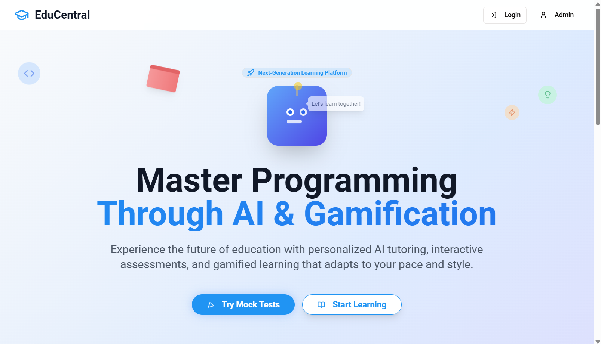
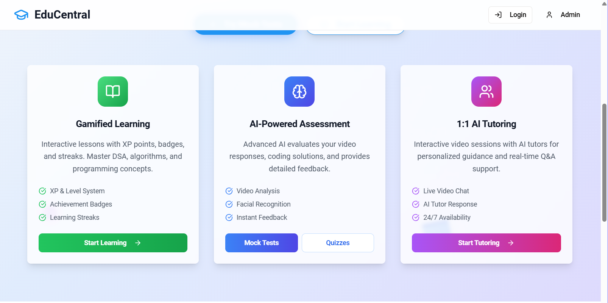
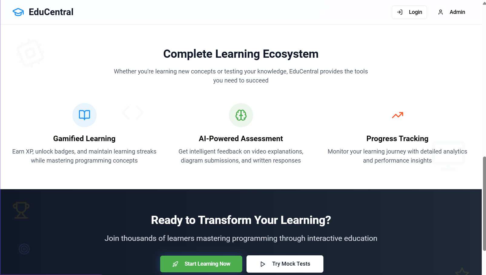

<p align="center">
  
</p>

# 🧠 EduCentral – AI-Powered Student Assessment & Learning System

[](https://www.gnu.org/licenses/agpl-3.0.en.html)
[](LICENSE-COMMERCIAL.txt)
[](https://github.com/NeuralAditya/EduCentral)
[](https://github.com/NeuralAditya/EduCentral/graphs/contributors)
[](https://github.com/NeuralAditya/EduCentral/issues)
[](https://github.com/NeuralAditya/EduCentral/commits/main)

<p align="left"> 
   
   
   
   
   
   
  
    
   
   
</p>

EduCentral is a full-stack AI-enabled assessment platform that helps students prepare better, get feedback instantly, and track their learning progress.

It integrates OpenAI (GPT-4o) or Puter.js (a local alternative) to power mock interviews, text/voice/photo analysis, and personalized tutor feedback — all aligned with real-world assessment standards.

✅ Use it locally as an offline prototype or connect it to a local LLM backend for zero-dependency usage.

## 🚀 Features

- 🧑‍🏫 AI-Powered Tutor (GPT-4o or Puter.js)
- 🎤 Video Assessment: Analyze speech, clarity, and emotional tone
- 🖼️ Image/Diagram Grading: Intelligent diagram analysis
- 📝 Text Submission Feedback: Score and provide feedback in real time
- 🧠 Quiz Engine: Create, assign, and evaluate quizzes per topic
- 📊 Progress Dashboard: Track performance, attempts, and growth
- 🔐 Local-first: Fully operational without internet (with Puter.js)

## 📸 Screenshots







## 🧰 Tech Stack

- **Frontend**: React, Vite, Tailwind CSS
- **Backend**: Node.js, Express.js
- **Database**: Neon (PostgreSQL serverless) with Drizzle ORM
- **Authentication**: Passport.js (Local Strategy)
- **AI Engine**: OpenAI (GPT-4o) / Puter.js (local)
- **Dev Tools**: TypeScript, Vite, Multer, Zod

## 🛠️ Setup & Installation

### ✅ Prerequisites

Ensure you have the following installed:

- [Node.js](https://nodejs.org/) (v18 or later)
- [npm](https://npmjs.com/) 
- [Git](https://git-scm.com/) 
- [OpenAI](https://openai.com/) (Optional for online mode)

### 🧪 Steps to Run the Project Locally

1. **Clone the repository:**
   ```bash
   git clone https://github.com/NeuralAditya/EduCentral.git
    cd EduCentral
   ```

2. **Install dependencies:**
     ```bash
        npm install
     ```

3. **Add your .env file (for online OpenAI mode)**
      ```bash
        cp .env.example .env
     ```
     Add DATABASE_URL and optionally OPENAI_API_KEY

4. **For Local Build**
   ```bash
   npm run build
   ```

5. **To run production build**
   ```bash
   npm start
   ```

6. **Navigate to `http://localhost:5000` to access the application.**

### 🔄 Switching between OpenAI and Puter

**To use OpenAI**: Add OPENAI_API_KEY to .env and use ai-tutor.ts with OpenAI logic.

**To use Puter.js (local)**: No API key required, just run your Puter server and update AI endpoints to:

```bash
const PUTER_API_URL = "http://puter.localhost:4100/api/chat";
```

## 🤝 Contributing

We welcome contributions! If you'd like to help out, please follow the steps below:

1. Fork the repository.
2. Create a new branch for your feature or fix:
   ```bash
   git checkout -b feature/my-new-feature
   ```
3. Make your changes.
4. Commit your changes:
   ```bash
   git commit -m "Add my new feature"
   ```
5. Push your branch:
   ```bash
   git push origin feature/my-new-feature
   ```
6. Open a pull request to the `main` branch.

Please ensure your code passes the tests and follows our coding standards before submitting a pull request.

## 📄 License

This project is **dual-licensed**:

- **GNU Affero General Public License v3.0 (AGPLv3)** – Open source under AGPLv3; see [LICENSE-AGPLv3.txt](license/LICENSE-AGPLv3.txt)
- **Commercial License** – For commercial use and proprietary licensing, see [LICENSE-COMMERCIAL.txt](license/LICENSE-COMMERCIAL.txt)

## 👥 Contributors

- **Aditya Arora** - [GitHub Link](https://github.com/NeuralAditya)
- **Brijesh Gupta** - [Email For Commercial Use](mailto:brijesh.ml.ai@gmail.com)
- **Aditya Dhurve** - [Contributor & Liason](mailto:aditya.dhurve@mitwpu.edu.in)

---

Made with ❤️ by the EduCentral team.
